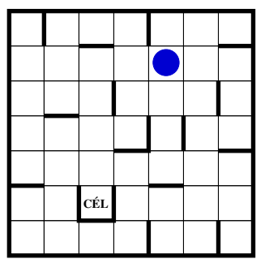

[](https://classroom.github.com/a/g5b-anKB)

---

## Magyar

# Gravitációs labirintus



Képzelj el egy fent látható játéktáblát!
A gravitációs labirintus lényege, hogy a startcellán álló korongot
a célcellába kell juttatnia a játékosnak úgy, hogy a golyó csak jobbra,
balra, felfele és lefele mozoghat, és minden egyes mozgásnál el kell
gurulnia egy falig, pont úgy, mintha a korongot egy vonzóerő mozgatná.

A gyökérkönyvtárban található `result.json` csupán egy példányfájl, a program az eredményeket
a `target/classes/labirynth/gui/result.json` fájlba írja.

---

## English

# Gravity-Labirynth

## Building from Source

Building the project requires JDK 25 or later and access to [GitHub Packages](https://docs.github.com/en/packages).

GitHub Packages requires authentication using a personal access token (classic) that can be created [here](https://github.com/settings/tokens).

> [!IMPORTANT]
> You must create a personal access token (PAT) with the `read:packages` scope.

You need a `settings.xml` file with the following content to store your PAT:

```xml
<settings xmlns="http://maven.apache.org/SETTINGS/1.0.0"
          xmlns:xsi="http://www.w3.org/2001/XMLSchema-instance"
          xsi:schemaLocation="http://maven.apache.org/SETTINGS/1.0.0 http://maven.apache.org/xsd/settings-1.0.0.xsd">
    <servers>
        <server>
            <id>github</id>
            <username><!-- Your GitHub username --></username>
            <password><!-- Your GitHub personal access token (classic) --></password>
        </server>
    </servers>
</settings>
```

The `settings.xml` file must be placed in the `.m2` directory in your home directory, i.e., in the same directory that stores your local Maven repository.

The result.json in this folder is just a mock-up version, the program writes the results
to target/classes/labirynth/gui/result.json.


Solution:
GravityLabyrinthState[position=Position[row=1, col=4]];
EAST GravityLabyrinthState[position=Position[row=1, col=6]];
SOUTH GravityLabyrinthState[position=Position[row=3, col=6]];
WEST GravityLabyrinthState[position=Position[row=3, col=5]];
SOUTH GravityLabyrinthState[position=Position[row=6, col=5]];
WEST GravityLabyrinthState[position=Position[row=6, col=4]];
NORTH GravityLabyrinthState[position=Position[row=5, col=4]];
WEST GravityLabyrinthState[position=Position[row=5, col=3]];
SOUTH GravityLabyrinthState[position=Position[row=6, col=3]];
WEST GravityLabyrinthState[position=Position[row=6, col=0]];
NORTH GravityLabyrinthState[position=Position[row=5, col=0]];
EAST GravityLabyrinthState[position=Position[row=5, col=1]];
NORTH GravityLabyrinthState[position=Position[row=3, col=1]];
EAST GravityLabyrinthState[position=Position[row=3, col=3]];
NORTH GravityLabyrinthState[position=Position[row=0, col=3]];
WEST GravityLabyrinthState[position=Position[row=0, col=1]];
SOUTH GravityLabyrinthState[position=Position[row=2, col=1]];
EAST GravityLabyrinthState[position=Position[row=2, col=2]];
SOUTH GravityLabyrinthState[position=Position[row=5, col=2]]
